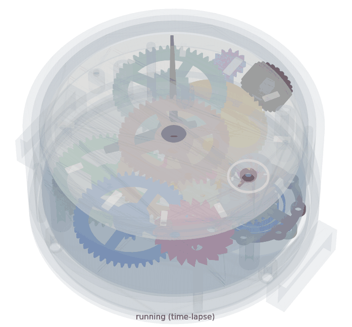
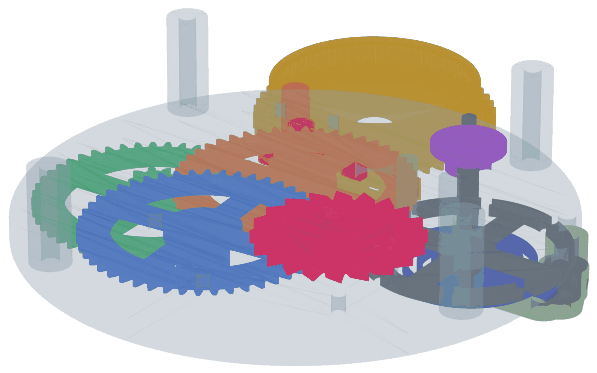
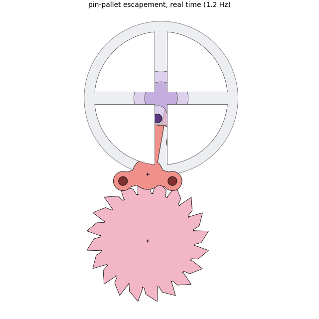
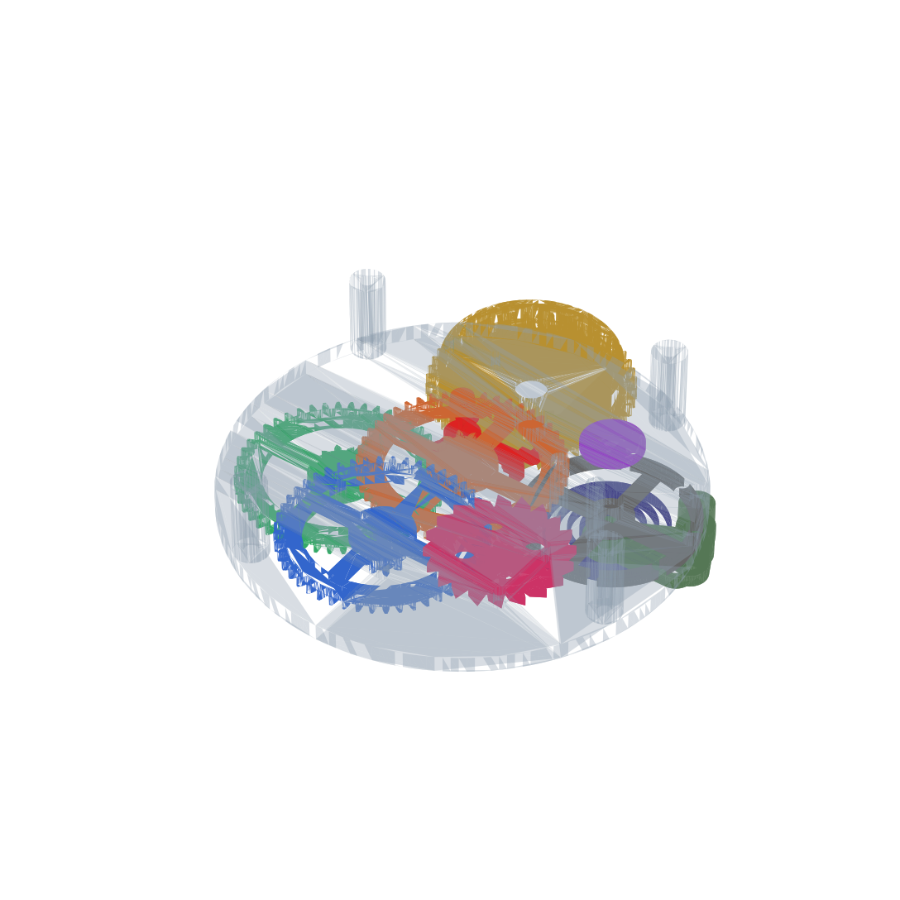
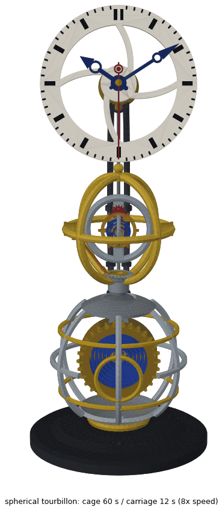
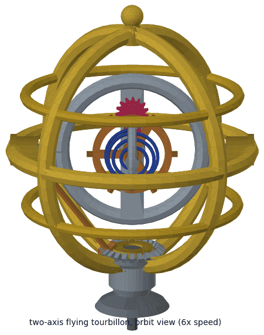
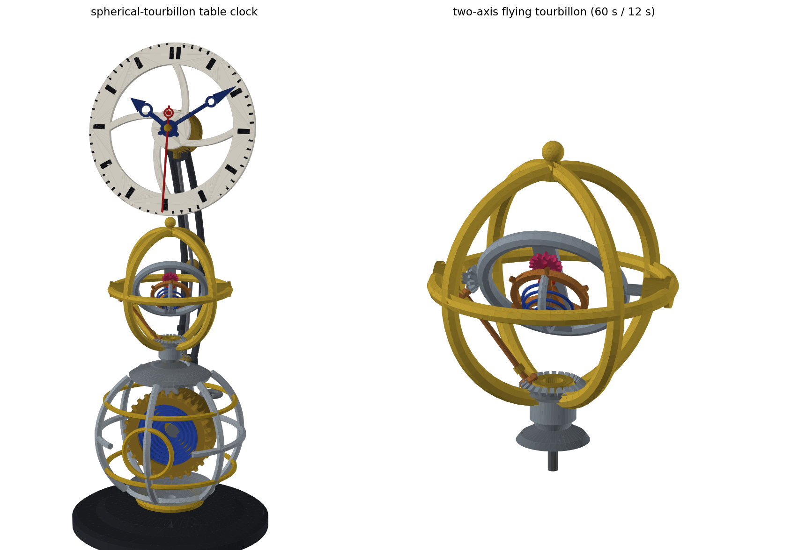

# Claude-Watch — a fully 3D-printable mechanical watch

> **NEW:** the collection now includes **[Armilla](#armilla--a-spherical-tourbillon-table-clock)**,
> a spherical-tourbillon *table clock* — a two-axis flying gyrotourbillon in
> an armillary sphere, on a sphere, under a floating dial. See below.

A mechanical (spring-driven, escapement-regulated) watch you can print on an
ordinary 0.4 mm-nozzle FDM printer. Every functional part is printed; the only
non-printed items are a handful of M3 screws, a few centimetres of 1.75 mm
filament used as pins/pivots, and optionally a strap.

* **Case diameter:** 88.6 mm (movement Ø80) — oversized on purpose so FDM
  tolerances don't kill it. It wears like a chunky pocket-watch on a 24 mm
  NATO-style strap (~40 mm thick). The crown sits at the wrist 3-o'clock
  position (the lugs are rotated 90° from the movement's barrel axis).
* **Movement:** going barrel → 3-stage 216:1 train → 20-tooth pin-pallet
  (Roskopf-type) lever escapement → balance wheel with printed hairspring.
* **Beat:** 1.2 Hz nominal (2.4 ticks/s), tunable with rim weights and three
  hairspring stiffness variants.
* **Indication:** hours + minutes (12:1 printed motion works) plus a
  **small-seconds sub-dial at 6 o'clock** — the escape arbor turns once
  per 100/6 s, and a 10:15 + 10:24 gear chain (with one idler so it runs
  clockwise) multiplies that by exactly 3.6 → 60.000 s per revolution.
* **Winding & setting:** a real crown, like a wristwatch. Pushed in, the
  stem pinion engages a lantern crown wheel that drives the ratchet wheel
  (click holds the charge). Pulled out ~6.5 mm, the same pinion engages a
  setting wheel whose shaft runs up through the movement to the minute
  wheel — turning the crown then sets the hands through the slipping
  cannon pinion. Roughly 3 usable mainspring turns ≈ a few hours of run
  time per wind (printed spring — expect hours, not days).



*Full sequence: running (time-lapse), winding at the crown, then pull-out
crown to set the hands — all driven by the real part geometry.*







> **Honesty note:** this is a v1 design produced and verified with a 2D
> kinematic simulation of the escapement (lock/impulse/drop check out at
> exactly one tooth per balance cycle) and automated clearance checks of the
> whole layout. Like every printed watch, it will need patient hand-fitting:
> light sanding of teeth and pivots, beat adjustment, and rate tuning.
> Expect accuracy of minutes per day, not seconds.

---

## 1. What to print (41 STLs in `stl/`)

All STLs are already oriented for printing (largest flat face down).
**No supports are needed for any part.**

| Part | Qty | Material | Layer | Notes |
|---|---|---|---|---|
| `back_plate` | 1 | PLA/PETG | 0.2 | pillars + banking posts integrated |
| `front_plate` | 1 | PLA/PETG | 0.2 | dial posts integrated |
| `balance_cock` | 1 | PLA/PETG | 0.2 | |
| `center_wheel`, `third_wheel`, `fourth_wheel`, `escape_wheel` | 1 ea | PLA | 0.12–0.16 | 100 % infill, slow perimeters |
| `center_arbor`, `balance_arbor`, `barrel_arbor` | 1 ea | PETG | 0.12 | printed standing; brim ON |
| `barrel_drum`, `barrel_lid` | 1 ea | PLA | 0.2 | |
| `mainspring` (1.3 mm) / `mainspring_strong` (1.6 mm) | 1 | **PETG** | 0.2 | print BOTH, start with regular |
| `ratchet_wheel`, `click` | 1 ea | PLA/PETG | 0.16 | click needs PETG (spring arm) |
| `crown_wheel`, `setting_shaft` | 1 ea | PLA | 0.12 | lantern bars print standing |
| `stem`, `crown`, `crown_tube` | 1 ea | PETG | 0.12 | stem prints standing on the pinion |
| `lever` | 1 | PLA | 0.12 | tiny — print 2–3 spares |
| `roller_main`, `roller_safety` | 1 ea | PLA | 0.12 | spares recommended |
| `balance_wheel` | 1 | PLA | 0.16 | |
| `hairspring` + `_soft` + `_stiff` | 1 ea | **PETG** | 0.12 | print all three, slow & cool |
| `cannon_pinion`, `minute_wheel`, `hour_wheel` | 1 ea | PLA | 0.12–0.16 | |
| `dial`, `minute_hand`, `hour_hand` | 1 ea | PLA | 0.16 | contrast colour! |
| `seconds_pinion`, `seconds_idler_a`, `seconds_idler_b`, `seconds_wheel`, `seconds_hand` | 1 ea | PLA | 0.12 | seconds_wheel prints standing on its gear |
| `case_ring`, `case_back` | 1 ea | PLA/PETG | 0.2 | case_ring prints upright, small internal bridges |

General settings: 0.4 mm nozzle, 100 % infill for everything smaller than the
plates, 4 perimeters on plates/case, print cool and slow for gears and
springs (≤ 40 mm/s outer walls). PETG where marked — the springs rely on it
(PLA springs creep and die quickly).

## 2. Bill of materials (non-printed)

* ~140 g filament total
* ~150 mm of straight 1.75 mm filament (the pins/pivots — see table below)
* M3 self-tapping or standard screws:
  * 4 × M3×10 — front plate to pillars
  * 2 × M3×8 — balance cock to back plate
  * 3 × M3×8 — case back to case ring
  * 1 × M3×8 — ratchet retaining screw (into barrel-arbor end)
  * 8 × M3×6 + 8 × M3 brass nuts — balance rim timing weights
* Cyanoacrylate (super) glue, fine sandpaper (400–800), a little PTFE or
  silicone grease (NEVER mineral oil on PLA)
* Optional: Ø76 mm disc of 2 mm acrylic (crystal, drops into the bezel seat),
  24 mm NATO strap

### Filament pin cutting list (1.75 mm)

| Pin | Length | Where |
|---|---|---|
| Train pivot pins ×3 | 19 mm | third, fourth, escape wheels (press into wheel bore, ends run in plate holes) |
| Lever stud ×1 | 19 mm | press into back plate at the lever position, lever pivots on it |
| Pallet pins ×2 | 3.6 mm | glue into the two small lever holes, flush with lever top |
| Impulse pin ×1 | 3 mm | glue into roller_main hole, flush with disc top |
| Hairspring stud ×1 | 4 mm | glue into balance-cock stud hole, sticking up |
| Click pivot + click spring abutment ×2 | 9 mm | press into back plate from the back (the click sits deep, at the ratchet level) |
| Crown-wheel stud ×1 | 9 mm | press into back plate from the back; the crown wheel spins on it |
| Minute-wheel stud ×1 | 8 mm | press into front plate from the front |
| Seconds idler studs ×2 | 7 mm + 5 mm | press into front plate from below (train side); idlers A and B spin on them |

Cut pins square with a sharp blade; chamfer the ends with sandpaper. Where a
pin runs in a 2.0 mm plate hole, the hole may need a quick pass with a 1.8 mm
drill bit if your printer prints holes tight.

## 3. How it works

```
mainspring barrel (48T) ─ 6:1 ─ center wheel/arbor (48T, 1 rev/h, carries hands)
   └ 6:1 ─ third wheel (48T) ─ 6:1 ─ fourth wheel (48T) ─ 6:1 ─ escape pinion
                                            escape wheel 20T (3.6 rev/min)
   escape wheel ⇄ pallet pins on lever ⇄ fork ⇄ impulse pin ⇄ balance (1.2 Hz)
   center arbor → cannon pinion (friction) → minute hand
   cannon 12T → minute wheel 48T → minute pinion 15T → hour wheel 45T (12:1) → hour hand

   crown (pushed) → stem pinion → crown wheel (lantern + 12T) → ratchet 18T → winds barrel arbor
   crown (pulled) → stem pinion → setting wheel (lantern) → shaft → 12T pinion → minute wheel → hands

   escape arbor (100/6 s/rev) → 10T pinion → idler A (15T+10T) → idler B (14T) → seconds wheel 24T
                                                            = exactly 60 s/rev, clockwise (sub-dial at 6)
```

The keyless works use "lantern" crown gears: rings of eight vertical
1.8 mm bars engaged by the six-finned stem pinion — a right-angle drive
that prints reliably (`docs/keyless.png` shows the layout and section).
The stem slides 6.5 mm in the crown tube between the two rings; its
flange inside the tube limits the travel.

The escapement is a pin-pallet (Roskopf) lever escapement: two vertical
filament pins on the lever alternately stop the escape-wheel teeth; the
sloped tooth backs push the pins (impulse), the lever's fork flicks the
balance's impulse pin, and the printed spiral hairspring swings the balance
back. The 2D simulation in `docs/escapement_sim.png` shows the geometry; the
wheel advances exactly one tooth (18°) per balance oscillation.

Diagnostics: `docs/layout.png` (wheel placement + clearances),
`docs/escapement_sim.png` (lock/release behaviour), `docs/fork_sim.png`
(fork, guard pin and safety-roller action). Animations of the movement
running: `docs/watch_full_animation.gif` (running + winding + setting
sequence), `docs/watch_animation.gif` (movement 3D) and
`docs/escapement_animation.gif` (escapement close-up) — regenerate with
`python -m watchgen.animate [full|3d|esc]`.

## 4. Assembly

Work on a clean tray — the pins are tiny. "Press" = push in with finger/pliers;
add a *tiny* drop of CA glue only where stated.

### A. Prepare the plates
1. Clean all holes. Run a 1.8 mm bit through the five 2.0 mm pivot holes in
   each plate if pins don't spin freely in them.
2. Press the 19 mm **lever stud** into the back plate's lever hole (the small
   1.6 mm hole between the escape-wheel hole and the balance hole) so it
   stands up on the train side. Glue from the back.
3. Press the two 9 mm **click pins** and the 9 mm **crown-wheel stud** into
   their small holes (left of and above the barrel hole), sticking out of
   the *back* face.
4. Press the 8 mm **minute-wheel stud** into the front plate's small hole
   (21 mm from centre), sticking out of the *front* face.

### B. Barrel
1. Drop the **mainspring** into the **barrel_drum**, outer hook tab into the
   wall slot, spiral matching (it only fits one way).
2. Push the **barrel_arbor** through the drum's bottom hole, winding square
   first (square exits the gear side). Hook the spring's inner C-ring over
   the arbor core so the tab sits in the core's slot.
3. Snap the **barrel_lid** into the drum's top recess.
4. Check: holding the arbor, the drum should rotate and wind up tension.

### C. Train (on the back plate, train side up)
1. Press a 19 mm pin through **third**, **fourth** and **escape** wheel bores
   (centred). The pin is the axle; wheel must be tight on it, pin free in
   plates.
2. Place the **center_arbor** through the centre hole (stub down), slide the
   **center_wheel** onto its square (pinion up).
3. Set the **barrel** on its hole (winding square down through the plate),
   then third, fourth and escape wheels into their holes. The layout only
   fits one way — see `docs/layout.png`.
4. Glue the two 3.6 mm **pallet pins** into the small holes of the **lever**,
   flush with the top face, hanging down. Set the lever onto its stud
   (fork pointing at the balance hole, pins over the escape wheel, guard bar
   under the fork).
5. **Balance arbor**: from the back of the plate, push the **balance_arbor**
   up through the large clearance hole (long pivot up). Onto the D-section
   between the plates slide: **roller_safety** (crescent facing the fork),
   then **roller_main** (pin hole facing the fork). Glue the 3 mm **impulse
   pin** into the main roller, hanging down so it reaches the fork slot.
6. Lower the **front_plate** onto the pillars, guiding the centre arbor,
   barrel stub and all five pivots into their holes. 4 × M3×10 into the
   pillars — snug, NOT tight. Everything must spin freely; loosen and re-seat
   if not. Spin the escape wheel backwards gently: the train should whirr.

### D. Back side (ratchet, click, keyless works)
1. **Ratchet_wheel** onto the winding square behind the back plate (it sits
   deep, close to where the case back will be), M3×8 into the arbor's end
   hole to retain it.
2. **Crown_wheel** onto its stud: lantern bars point *up* toward the plate
   pocket, the 12T gear at the bottom meshing the ratchet. A tiny CA-glued
   filament washer on the stud tip retains it.
3. **Setting_shaft** up through its plate hole (the long shaft with the
   lantern disc at the bottom and the 12T pinion at the top, which meshes
   the minute wheel on the front side once the motion works are on).
4. **Click** over its pivot pin, beak into the ratchet teeth, spring arm
   bent against the abutment pin. Turn the crown wheel by hand: the ratchet
   must click forward and hold back. (If your print came out mirrored,
   flip the click over.)
3. **Hairspring** onto the balance arbor's lower square (it sits above the
   balance), **balance_wheel** onto the square below it. Glue the 4 mm
   **stud pin** into the balance-cock stud hole. Hook the hairspring's outer
   tab over the stud pin, then screw the **balance_cock** down (2 × M3×8),
   guiding the lower pivot into the cock's cup.
4. **Beat:** at rest the impulse pin should sit inside the fork slot. The
   square mount gives 90° steps; choose the closest, then twist the
   hairspring's outer tab gently for fine adjustment.
5. Fit 4 M3 screws + nuts into opposite balance-rim holes (start with 4 of 8
   filled, symmetric!).

### E. Motion works, dial, hands
1. Press the **cannon_pinion** down over the centre-arbor's ribbed tip until
   it grips (friction fit — it must turn with the arbor but slip under firm
   finger torque).
2. **Minute_wheel** onto its stud (gear meshing the cannon), tiny CA-glued
   filament-scrap washer or a blob on the stud tip to retain it.
3. **Hour_wheel** pipe over the cannon pipe (its gear meshes the minute
   pinion).
4. **Dial** onto the four post pegs (pegs through the dial holes, glue).
5. Press the **seconds_hand** onto the seconds-arbor tip poking through
   the sub-dial, then **hour_hand** onto the hour pipe and **minute_hand**
   onto the cannon tip, both pointing at 12.
6. Time is set from the crown once cased (the setting wheel drives the
   minute wheel, slipping the cannon on the arbor). Before casing you can
   also simply turn the minute hand.

### F. Case, stem and crown
1. Glue the **crown_tube** into the rectangular slot in the case wall
   (flange on the inside, counterbore facing out).
2. Slide the movement into the **case_ring** from the back until the front
   plate seats against the internal shoulder, with the stem slot at the
   movement's barrel side (12 o'clock of the movement = 3 o'clock of the
   case). (Optional acrylic crystal goes into the bezel recess first.)
3. Feed the **stem** through the crown tube from the inside (pinion inward,
   flange entering the tube's counterbore), then glue the **crown** onto
   the stem's square from outside.
4. **Case_back** on with 3 × M3×8 into the wall bosses — the round window
   shows the balance; the small recess clears the setting wheel.
5. Thread a 24 mm strap through the lug slots.

### G. First run
1. Push the crown in and wind 10–20 turns. You should hear the click.
2. Give the balance a twist through the case-back window. It should keep
   ticking. If it doesn't, see below — *every* printed watch needs
   fettling on the first build.
3. Pull the crown out until the flange stops (~6.5 mm) and turn to set the
   hands; push it back in to wind/run.

## 5. Tuning & troubleshooting

| Symptom | Fix |
|---|---|
| Train doesn't spin freely with no balance | Find the binding mesh (turn each wheel by hand), lightly sand pinion teeth / wheel teeth; check pins are perpendicular; one drop of grease per pivot |
| Ticks a few times, stops | More mainspring (more winding), or swap in `mainspring_strong`; reduce balance amplitude loss: make sure hairspring touches nothing; sand pallet-pin tips smooth |
| Balance flutters / wheel races through | Pallet pins too shallow: re-glue pins fully seated; check lever swings freely between banking posts but no further |
| Lever sticks on banking | Sand the banking posts slightly |
| Runs fast | Add rim screws/nuts (heavier balance = slower), or swap to `hairspring_soft` |
| Runs slow / stops with all weights | Remove rim weights or swap to `hairspring_stiff` |
| Hands don't move though it ticks | Cannon pinion slipping: pinch its slotted section, or thicken the arbor tip with a layer of CA glue |
| Winding slips | Check click spring engagement and that the crown-wheel gear meshes the ratchet |
| Crown turns but nothing happens | Stem pinion not reaching the lantern bars: check the stem is pushed fully home (wind) or pulled to the stop (set); deepen the case-wall slot so the tube sits flush |
| Hands don't move when setting | Setting-shaft top pinion must mesh the minute wheel — check the shaft is fully seated in both plate holes |
| Mainspring slips at full wind | Deepen/clean the drum wall slot so the outer tab hooks firmly |

Rate maths: 1.2 Hz nominal. Time 20 oscillations with a stopwatch — should
take 16.7 s. Heavier rim → slower; stiffer spring → faster
(rate ∝ √(stiffness / inertia)).

## 6. Regenerating / customising the design

Everything is parametric Python (`watchgen/`):

```bash
pip install -r requirements.txt
python -m watchgen.generate        # clearance checks + 32 STLs + layout.png
python -m watchgen.sim_escapement  # escapement kinematic verification
```

All dimensions live in `watchgen/params.py` (tooth counts, module, beat
rate, case size, fits/tolerances). The generator refuses to bless the STLs
if any clearance check fails, and the escapement simulator confirms the
wheel advances exactly one tooth per balance cycle before you print.

If your printer runs tight or loose, tweak in `params.py`:
`BACKLASH` (gear play), `PIN_HOLE_BEAR` / `PIN_HOLE_PRESS` (pivot fits),
`CANNON_BORE` (hand-setting friction), and reprint only the affected parts.

---

# Armilla — a spherical-tourbillon table clock

The second piece in the collection is not a watch but a **table clock**:
a ~31 cm totem with a **two-axis flying spherical tourbillon**
(gyrotourbillon) floating between an armillary-sphere base and a
floating chapter-ring dial. Being a display piece, it is allowed to be
big, theatrical and intricate where the watch had to be wearable.



*One loop = one real minute, played at 8× speed: the outer cage turns
once (60 s), the inner carriage five times (12 s), the second hand makes
one revolution, and the visible seconds line spins up the swan-neck
columns to the dial.*



*The heart, orbit view: the gold outer cage spins about the vertical
axis while the steel inner carriage somersaults about a horizontal axis
carried by the cage — the balance axis tumbles through every
orientation in space (that is the point of a multi-axis tourbillon:
gravity error averages out over the sphere, not just a circle).*



## Architecture (bottom to top)

* **Plinth + cradle** — a turned base with a gold cradle ring.
* **Base sphere** (Ø92) — an openwork armillary globe: solid polar caps,
  six meridian ribs, two gold latitude hoops, and a gold-bezelled
  porthole that frames the **mainspring barrel** inside (blued spiral,
  Ø54 drum, axis pointing at the viewer). The **winding key** enters
  through the back porthole; its arbor carries the ratchet held by a
  click. A ring gear around the drum drives the **transfer pinion**
  into the collar **gearbox** (which encloses a 48:1 reduction).
* **Stalk + sun crown** — a fixed vase on the sphere's collar carries a
  trumpet around the cage pipe, crowned by the stationary **sun wheel**.
* **Tourbillon sphere** (Ø77) — the flying two-axis carriage:
  * the **centre shaft** (1 rpm, from the gearbox) is keyed into the
    cage pipe: the **outer cage** — two gold meridian rings at 45°/135°,
    an equator ring, polar hub and finial — turns once per **60 s**;
  * the stationary sun crown walks the **planetary lay shaft** (the
    copper rod riding on the cage), which bevels into the carriage
    pivot: the **inner carriage** — steel ring + bar — somersaults once
    per **12 s** about a horizontal axis that itself rotates;
  * inside ride the **escapement** (15-tooth wheel, pin-pallet lever)
    and the **balance** (copper, 3 spokes, 6 timing screws) under a
    **spherical hairspring** — a blued spiral climbing a dome, the
    signature of real gyrotourbillons — all beneath an arched cock with
    a ruby endstone.
* **Seconds line** — the 1 rpm motion leaves the gearbox through 1:1
  bevels: Y-rod → pod → **two spinning shaft segments** relayed at the
  knuckle of the twin **swan-neck columns** that bow around the
  tourbillon → canister inlet.
* **Dial** (Ø104, tilted back 12°) — a floating ivory chapter ring with
  raised batons and a 60-tick minute track, S-curve spokes, and **hour /
  minute / second** hands (Breguet-style, blued; red seconds with a
  pierced counterweight). The brass **canister** behind the hub encloses
  the /60 and /12 motion works; seconds are taken 1:1 from the column
  shaft.

```
mainspring barrel (1 rev/3 h) ── drum ring gear 30T ── transfer pinion 8T
        └─[48:1 in the collar gearbox]─ centre shaft  (1 rev/min)
              ├── tourbillon cage (60 s/rev)
              │      └ sun crown 24T (fixed) ⇄ lay-shaft bevels ⇄ carriage
              │         pivot 12T  →  inner carriage (12 s/rev)
              │            └ escape pinion ⇄ 15T escape wheel ⇄ pin-pallet
              │              lever ⇄ roller ⇄ balance (2.5 Hz, spherical
              │              hairspring)
              └── 1:1 bevels: Y-rod → pod → column shafts (relay knuckle)
                    → canister: seconds 1:1, minutes /60, hours /12
```

## Regenerating

```bash
pip install -r requirements.txt
python -m clockgen.generate        # clearance checks + 33 STLs + renders
python -m clockgen.animate         # both GIFs (several minutes)
```

Everything is parametric (`clockgen/params.py`); the build is data-driven:
each rotating part is modelled in its own spin frame and placed by a
kinematic chain (`clockgen/parts.py`), so the same description produces
the STLs, the 19 automated clearance checks (`clockgen/generate.py` —
including the planetary-rod-versus-tumbling-carriage sweep) and the
animations (`clockgen/animate.py`). `docs/clock_layout.png` shows the
side elevation with the main dimensions.

> **Honesty note:** unlike the watch, whose escapement was kinematically
> simulated part-against-part, Armilla is a *design study*: the gear
> ratios are consistent and every moving part clears every other (the
> checks enforce it), but the bevel meshes are representative rather
> than tooth-profiled. The STLs in `stl_clock/` print as a display
> model — a non-running armillary automaton you can motorise from the
> key arbor — not (yet) as a self-running clock. Printing the cage and
> swan-necks needs supports; everything else prints flat.
